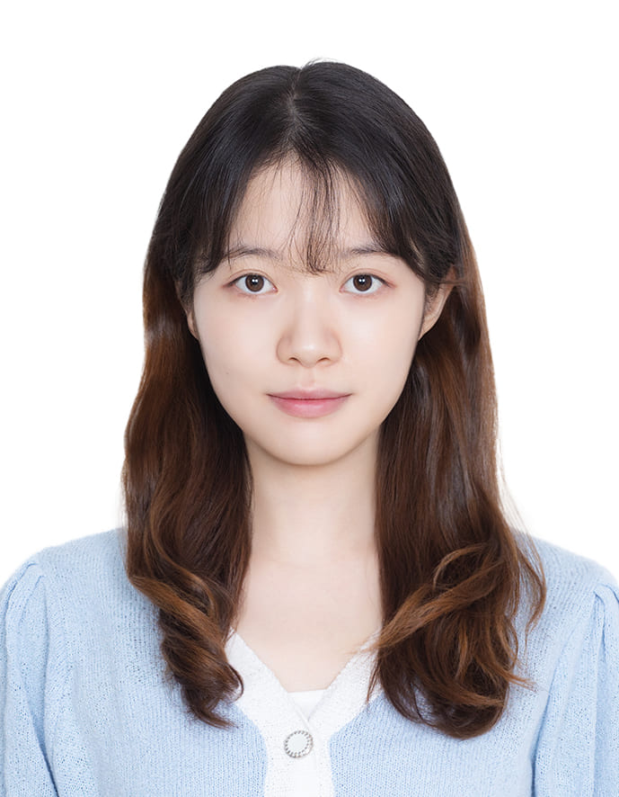
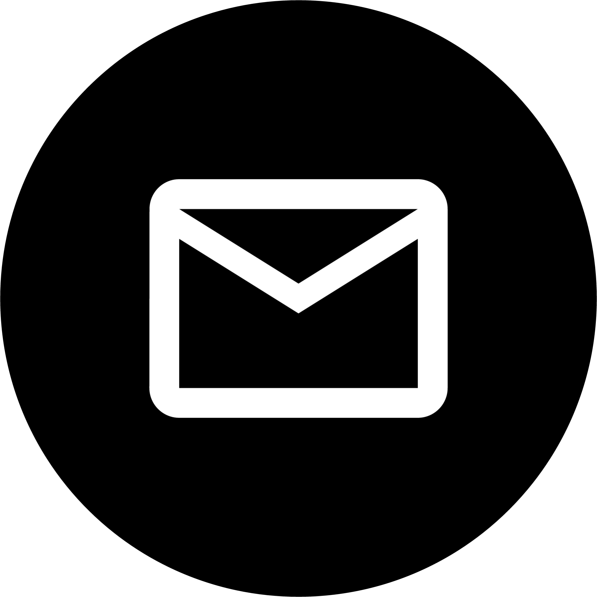
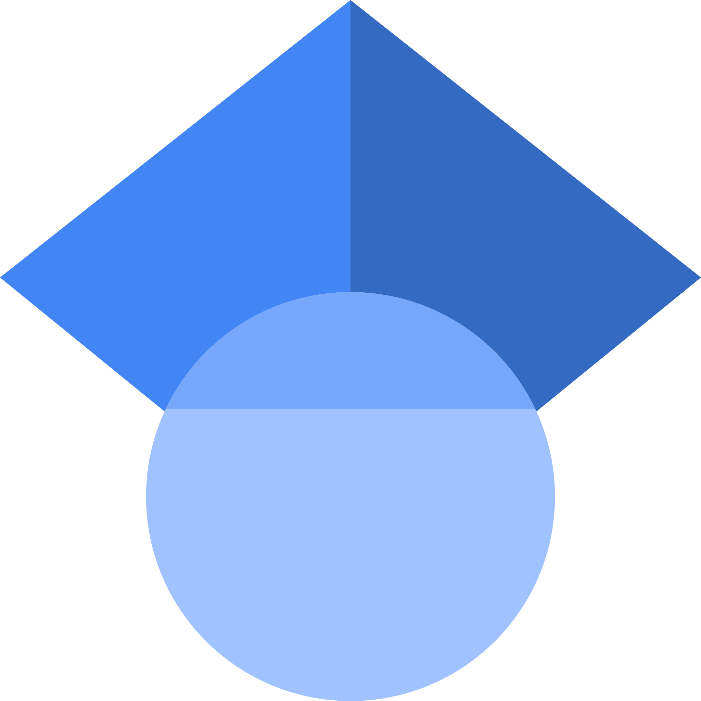

## About Me

  

  

    
    
    
    
    
  

Hi! I am a Master student at [KAIST School of Computing](https://cs.kaist.ac.kr/), working under the supervision of [Prof. Alice Oh](https://aliceoh9.github.io/).  
My research interests lie in **Natural Language Processing(NLP)**, **Machine Learning(ML)**, and **Graph Neural Network(GNN)**. Recently, I have been focusing on (1) Evaluation of LLM to enhance its reasoning on planning (2) Evaluation of LLM on its multilinguality (3) Application of AI in the aspect of cultural understanding and (4) Mechanistic Interpretibility of Language models.

<!-- ## Research Interest

 My research interests lie in **Natural Language Processing(NLP)**, **Machine Learning(ML)**, and **Graph Neural Network(GNN)**. 
 Recently, I have been focusing on (1) Evaluation of LLM to enhance its reasoning on planning (2) Evaluation of LLM on its multilinguality (3) Application of AI in the aspect of cultural understanding and (4) Mechanistic Interpretibility of Language models. -->

## Publications

1. \*Seyoung Song, **\*Seogyeong Jeong**, Eunsu Kim, Jiho Jin, Dongkwan Kim, Jay Shin, Alice Oh. 2025. MUG-Eval: A Proxy Evaluation Framework for Multilingual Generation Capabilities in Any Language (2025) [\[ArXiv\]](https://arxiv.org/abs/2505.14395)
2. \*Junyeong Park, **\*Seogyeong Jeong**, \*Seyoung Song, Yohan Lee, Alice Oh. 2025. LLM-C3MOD: A Human-LLM Collaborative System for Cross-Cultural Hate Speech Moderation. In *NAACL 2025 Workshop - C3NLP(Workshop on Cross-Cultural Considerations in NLP)* [\[ArXiv\]](https://arxiv.org/abs/2503.07237) [\[Slides\]](https://docs.google.com/presentation/d/1vrY2a9SjjJcQppSSRhxNuJyC0pyzdlxPdgk0KB6Lfp4) [\[Poster\]](/materials/LLM-C3MOD.pdf)
3. Paul Röttger, Giuseppe Attanasio, Felix Friedrich, Janis Goldzycher, Alicia Parrish, Rishabh Bhardwaj, Chiara Di Bonaventura, Roman Eng, Gaia El Khoury Geagea, Sujata Goswami, Jieun Han, Dirk Hovy, **Seogyeong Jeong**, Paloma Jeretič, Flor Miriam Plaza-del-Arco, Donya Rooein, Patrick Schramowski, Anastassia Shaitarova, Xudong Shen, Richard Willats, Andrea Zugarini, Bertie Vidgen. 2025. MSTS: A Multimodal Safety Test Suite for Vision-Language Models. *arXiv preprint* [\[ArXiv\]](https://arxiv.org/abs/2501.10057)

## Education
- **Korea Advanced Institue of Science and Technology (KAIST)** (Sep 2024 - Present)
    - M.S. in [School of Computing](https://cs.kaist.ac.kr/)
    - Advisor: Alice Oh
- **Korea Advanced Institue of Science and Technology (KAIST)** (Feb 2019 - Aug 2024)
    - B.S. in [School of Computing](https://cs.kaist.ac.kr/)(Major) and [Mathematical Sciences](https://mathsci.kaist.ac.kr/home/)(Minor), [Electrical Engineering](https://ee.kaist.ac.kr/) and [Bio and Brain engineering](https://bioeng.kaist.ac.kr/) (Individually designed major)

## Work Experience
- [User & Information Lab](https://uilab.kr/) *Jun 2022 - Aug 2024*
  - *Research Intern*
  - Graph Neural Network, Text sentiment classification
- [Emerging Nano Technology and Integrated Systems Lab](https://shinhyunlab.kaist.ac.kr/) *Jun 2021 - Feb 2022*
  - *Research Intern*
  - Artificial neuron array based Neuromorphic computing

## Teaching Experience
- KAIST Computer Science Department Course [Introduction to Computer Programming](https://cs101.kaist.ac.kr/) *25S*

<!-- 
## Typography

This is a [link](http://google.com). Something *italics* and something **bold**.

Here is a table

Year | Award | Category
-----|-------|--------
2014 | Emmy  | Won Outstanding Lead Actor in a miniseries or a movie
2015 | BAFTA | Nominated for Best Leading Actor for Sherlock
2014 | Satellite | Won Best Actor miniseries or television film

Here is a horizontal rule

---

Here is a blockquote

> To a great mind, nothing is little

<!-- ## References

* Foo Bar: Head of Department, Placeholder Names, Lorem
* John Doe: Associate Professor, Department of Computer Science, Ipsum --> 
